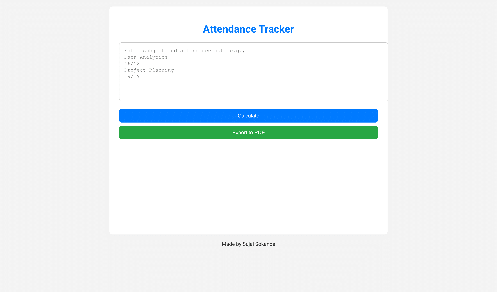

# Attendance Tracker


## Overview
The **Attendance Tracker** is a web-based tool designed to track attendance for various subjects, calculate overall attendance percentages, and determine exam eligibility. The tool features a dark mode, bar chart visualizations, and the ability to export attendance results to PDF.

## Features
- **Subject-wise Attendance Input:** Enter subject names and corresponding attendance data.
- **Eligibility Check:** Automatically checks eligibility based on the 80% attendance rule.
- **Visual Representation:** Displays attendance percentages using [Chart.js](https://www.chartjs.org/).
- **Export to PDF:** Generate a PDF report of your attendance data using [jsPDF](https://github.com/parallax/jsPDF).
- **Dark Mode:** Toggle between light and dark themes for better accessibility.

## Live Demo
👉 [Try the Attendance Tracker](https://sokandesujal.github.io/Attendance-Tracker/)

  
*A sample screenshot of the Attendance Tracker interface.*

## How to Use
### Step 1: Clone the Repository
```bash
git clone https://github.com/sokandesujal/Attendance-Tracker.git
```

### Step 2: Open the Project
- Open the `index.html` file in your browser.

### Step 3: Input Data
- Enter subject names and attendance in the text area in the following format:
    ```
    Data Analytics
    46/52
    Project Planning
    19/19
    ```
  
### Step 4: Calculate Attendance
- Click the **Calculate** button to view overall and subject-wise results.

### Step 5: View Results
- The tool will display:
  - Total attendance and overall percentage.
  - Subject-wise percentage and exam eligibility (80% attendance required).
  - The number of classes you can miss or need to attend for each subject.
  
### Step 6: Export to PDF
- Click the **Export to PDF** button to generate and download a report of the attendance data.

## Code Structure
- **HTML**: Structure of the webpage is defined in `index.html`.
- **CSS**: Styling for the webpage is in `styles.css`. It supports both light and dark modes.
- **JavaScript**: Logic for calculations, chart updates, and PDF generation is in `script.js`.

## Technologies Used
-  HTML5 for structure
-  CSS3 for styling
-  JavaScript (Vanilla) for interactive features
-  for visualizing attendance data
-  for exporting data to PDF

## Project Files
```bash
Attendance-Tracker/
│
├── index.html        # Main HTML file for the Attendance Tracker
├── styles.css        # CSS file for styling the page
├── script.js         # JavaScript file containing logic and event handling
└── README.md         # Project documentation
```

## Future Enhancements
- **Authentication:** Add user accounts to save attendance data.
- **Data Persistence:** Integrate local storage or a database to store attendance records.
- **Graph Customization:** Allow users to customize the appearance of charts.

## Contributing
Pull requests are welcome. For major changes, please open an issue first to discuss what you would like to change.

## License
This project is licensed under the MIT License - see the [LICENSE](LICENSE) file for details.

## Contact
For any inquiries or feedback, please contact me at [your-email@example.com].
```

### Tips:
- Replace `path-to-screenshot.png` with the actual path to your screenshot.
- Customize the email address and any other links as necessary.

This format makes the README visually appealing while maintaining clarity and functionality.
